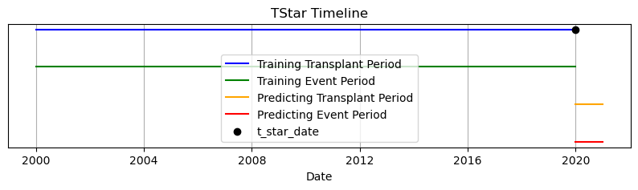

# TStar: a temporal validation framework for survival models

This repository hosts experiments on survival modeling using the UNOS dataset. Please adhere to the following structure for organizing content:

- **Python Code:** All functions and classes should be placed in the `src` folder.
- **Data:** Store all data exclusively in the `data` folder and ensure it remains local.
- **Results and Visualizations:** Implement all results, visualizations, and summaries of the experiments in the `notebooks` folder.


## Create Environment

To set up the environment for this repository, ensure you are using Python 3.12.5, which was used during its creation. You can create either a Conda environment or a Python virtual environment.

### 1. Using Conda Environment

If you prefer using **Conda** for environment management, follow these steps:

#### Steps to Create Conda Environment:

1. **Install Miniconda/Anaconda**:  
   Ensure that you have Miniconda or Anaconda installed. If not, you can install Miniconda by following [this link](https://docs.conda.io/en/latest/miniconda.html).

2. **Create a New Conda Environment**:  
   Run the following command to create a new environment with Python 3.12.5:
   
   ```bash
   conda create -n survival python=3.12.5
   ```

   Replace `myenv` with the desired name for your environment.

3. **Activate the Environment**:  
   Activate the Conda environment by running:

   ```bash
   conda activate myenv
   ```

4. **Install Dependencies**:  
   After activating the environment, install the necessary packages from the `requirements.txt` file by running:

   ```bash
   pip install -r requirements.txt
   ```


### Deactivating the Environment

When you are done, you can deactivate the environment by running:

- For **Conda**:

  ```bash
  conda deactivate
  ```

- For **Python virtual environment**:

  ```bash
  deactivate
  ```

## Pipeline Overview

This pipeline is designed to perform time-to-event analysis using the Cox Proportional Hazards Model. Below is a step-by-step summary of the process:

1. **Initialize TStar Configuration**:  
   The `TStar` object is initialized with parameters that configure the time-based settings for the analysis. This example loads a EUROTRANSPLANT data set.

   ```python
   
   date_for_prediction = int(365.25*5)

   t_star = TStar(t_star_date="31-12-2019", txpt=20, 
            ept=20, txpp=1, epp=1, 
            load=False, indexes_from_ID=None, dataset='EUROTRANSPLANT')
   ```
2. **Optional Visualization**:  
   If enabled, the `visualize_t_star()` function will generate a visualization of the `t_star` configuration.

   ```python
   t_star.visualize_t_star()   
   ```
  

3. **Data Retrieval**:  
   Data is retrieved using the `get_data()` method of the `TStar` object, based on the specified configuration.

   ```python
   t_star.get_data()
   ```

4. **Preprocessing**:  
   The `PreprocessingPipeline` is used to preprocess the retrieved data. This includes splitting the data into training and testing datasets.

   ```python
   pipeline = PreprocessingPipeline()
   df_train, df_test = pipeline.run(t_star)
   ```
   The basic pipeline considers binarization, checking of ranges, creation of variables and data type setting (e.g.,`to_numeric`). 

   To verify the data split:

   ```python
   print(df_test.shape)
   print(df_train.shape)
   ```

5. **Data Imputation**:  
   Missing data is handled separately for the training and testing datasets using the `MICE` (Multiple Imputation by Chained Equations) method.

   ```python
   impute_train = MICE(10, 5, t_star, df_train, phase='Train')
   impute_train.run()

   impute_test = MICE(10, 5, t_star, df_test, phase='Test')
   impute_test.run()
   ```